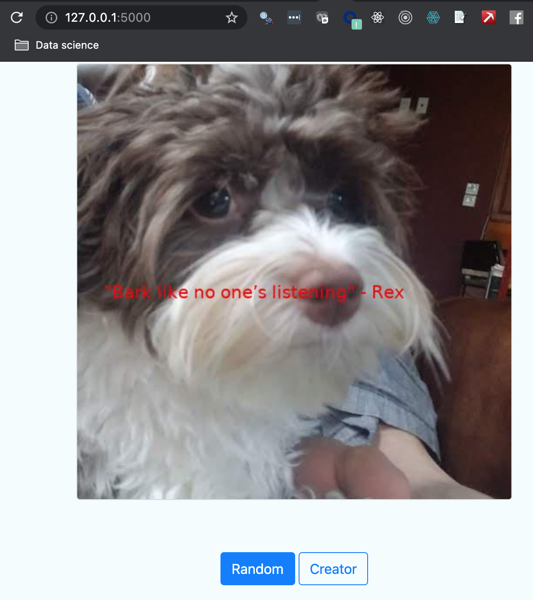
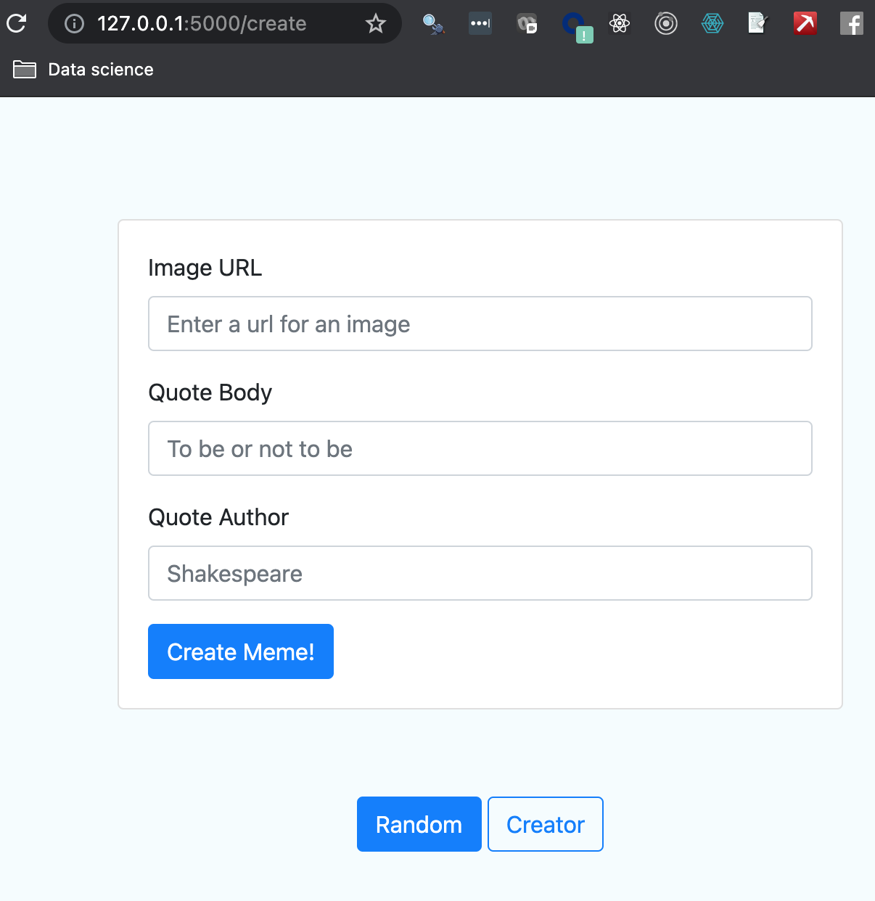

# Meme Generator

## Overview
This project is an interactive app that generates (and saves to your local) meme with a quote from an author,
on top of a (by default, dog) picture. It supports command line inputs for you to customize the
quote and the author. 

A Flask app allows you to generate random meme on top of local dog pictures, and allows
you to customize your own meme with pictures online (via `requests`)

## Environment and set up
Set up this project on a unique conda environment with python 3.9
`conda create --name meme_generator python=3.9`

Activate the conda environment by `conda activate meme_generator`

Install the required python packages via `pip install -r requirements.txt`, including
python package `pdftotext`. Due to my macOS version, I am not able to install `pdftotext`
via `brew` command (then use subprocess)

## Folder structure

This project

```bash
├── src
│   ├── _data
│   │   ├── *
│   ├── MemeEngine
│   │   ├── __init__.py
│   │   ├── meme_engine.py
│   ├── QuoteEngine
│   │   ├── __init__.py
│   │   ├── ingestor_interfaces.py
│   │   ├── ingestor.py
│   │   ├── quote_model.py
│   ├── templates
│   │   ├── *
│   ├── tmp
│   │   ├── (output)
│   ├── app.py
│   ├── meme.py
├── requirements.txt
├── demo.gif
├── README.md
└── .gitignore
```

## How to run?

Run meme.py from project root folder

#### Program 1: meme.py 
(Generate memes and save pitures on the local folder)
It supports CLI arguments via argparser. 

Run in the `/src` directory
```python
python3 meme.py [-h] [--path PATH] [--body BODY] [--author AUTHOR]
```

Run `--help` first to check the optional arguments:
```bash
usage: meme.py [-h] [--path PATH] [--body BODY] [--author AUTHOR]

Load an image and texts to generate meme.

optional arguments:
  -h, --help       show this help message and exit
  --path PATH      The path of the image to generate a meme
  --body BODY      The main text to be put on the image
  --author AUTHOR  The author of the main text to be put on the image
```

#### Program 2: app.py
(Generates random or customized meme via a Flask app)

Run in the `/src` directory
```python
python3 app.py
```

You will be able to access the app through http://127.0.0.1:5000/ (landing page for "random"). 



You can also create your own meme through http://127.0.0.1:5000/create 



If the requests for the image url does not return 200, the app will generate error
and you need to select another image url that can be requested


## Submodules

### QuoteEngine submodule

Create quote objects by ingesting various sources through ingestion interfaces (II) 
from `ingestor_interfaces.py`, including:

- .csv (via `CSVIngestorInterface`)
- .txt (via `TXTIngestorInterface`)
- .pdf (via `PDFIngestorInterface`)
- .docx (via `DOCXIngestorInterface`)

The script `ingestor.py` is used to determine which II to choose, in order to make the ingestion

The `QuoteModel` class from `quote_model.py` holds the quote object ingested from an II, with:
- body (ex. "He who smelt it...")
- author (ex. "stinky")

submodule structure
```bash
├── QuoteEngine
│   ├── __init__.py
│   ├── ingestor_interfaces.py
│   ├── ingestor.py
│   ├── quote_model.py
```


### MemeEngine submodule

Generate meme by placing a quote ingested from the QuoteEngine module, on top
of a randomly chosen `.jpg` picture of a dog.

Main functionality in the meme_engine.py

- load image using Pillow (PIL)
- resize the image with max width at 500px,
    and the height is scaled proportionally
- add a quote body and a quote author to the image
- save the manipulated image
- implement the instance method that returns the path to the manipulated image
    make_meme(self, img_path, text, author, width=500) -> str

submodule structure
```bash
├── MemeEngine
│   ├── __init__.py
│   ├── meme_engine.py
```

